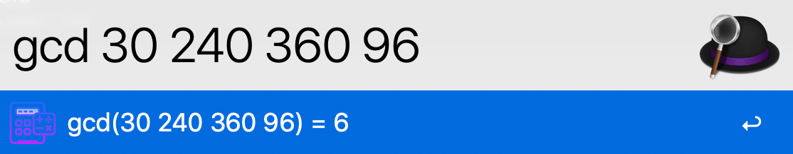
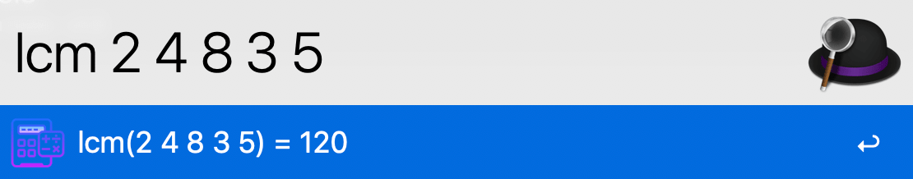
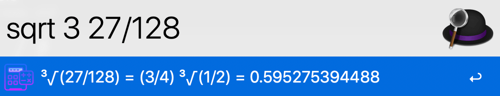

## Alfred workflow: Math tools

##### Description:

A set of *useful* and *convenient* math tools.

##### Download:

Go [here](https://github.com/Emrys365/alfred_workflows/blob/master/MathTools.alfredworkflow) and download it directly.

#### 1) Simplify fractions

##### Examples:

+ `frac .11`  ==>  `.11 = 11 / 100`
+ `frac 4/6`  ==>  `4/6 = 2 / 3`
+ `frac -1.4/2.2`  ==>  `-1.4/2.2 = -7 / 11`

#### 2) Greatest common divisor

##### Examples:

#### 3) Least common multiple

##### Examples:

#### 4) Simplify surds

##### Examples:

- `sqrt .0144`  ==>  `√(.0144) = 3/25 = 0.12`
- `sqrt 3 8/81`  ==>  `³√(8/81) = (2/3) ³√(1/3) = 0.462240849567`

##### Note:
>  Negative numbers are not supported.

#### 5) Log functions

##### Examples:

- `log 5`  ==>  `log₁₀(5) = 0.698970004336`
- `log2 1.0001`  ==>  `log₂(1.0001) = 0.000144262291095`
- `ln e`  ==>  `ln(e) = 1.0`

##### Note: 

> *e=2.718281828...* can be used only in some simple cases, and in most cases it is used as the *scientific notation*.

#### 6) Prime factorization

##### Examples:

+ `factor 100`  ==>  `factor(100) = [1, 2, 2, 5, 5]`
+ `factor 31`  ==>  `factor(31) = [1, 31]`

##### Note:

> The maximum value of input integer is limited in case of memory overflow.

#### 7) Permutations and Combinations

##### Examples:

+ `C( 4 2`  ==>  `C(4, 2) = 6 `
+ `c( 1000 3`  ==>  `C(1000, 3) = 166167000 `
+ `P( 4 2`  ==>  `P(4, 2) = 12`
+ `p( 1000 3`  ==>  `P(1000, 3) = 997002000 `

##### Note: 

> The maximum value of *m* is limited for both permutations and combinations.

#### 8) Base conversion

##### Examples:

+ `num 10`  ==>  `base₂ = 0b1010`; `base₈ = 012`; `base₁₆ = 0xa`
+ `num 0b101` ==> `base₈ = 05`; `base₁₀ = 5`; `base₁₆ = 0x5`
+ `num 077` ==> `base₂ = 0b111111`; `base₁₀ = 63`; `base₁₆ = 0x3f`
+ `num 0o77` ==> `base₂ = 0b111111`; `base₈ = 077`; `base₁₀ = 63`; `base₁₆ = 0x3f`
+ `num 0x24` ==> `base₂ = 0b100100`; `base₈ = 044`; `base₁₀ = 36`

#### 9) Bitwise Calculation

##### Examples:

##### supported operations:

+ `>>` : left shift
+ `<<` : right shift
+ `|` : bitwise OR
+ `&` : bitwise AND
+ `^` : bitwise XOR
+ `~` : bitwise NOT
+ `+` : add
+ `-` : subtract
+ `*` : mulitply
+ `//` : floor divide
