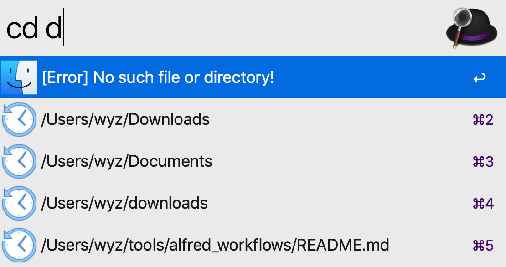

# alfred_workflows

### 1. Math tools

##### Description:

A set of *useful* and *convenient* math tools.

##### Download:

Go [here](https://github.com/Emrys365/alfred_workflows/blob/master/MathTools/MathTools.alfredworkflow) and download it directly.

#### 1) Simplify fractions

##### Examples:

+ `frac .11`  ==>  `.11 = 11 / 100`
+ `frac 4/6`  ==>  `4/6 = 2 / 3`
+ `frac -1.4/2.2`  ==>  `-1.4/2.2 = -7 / 11`

#### 2) Greatest common divisor

##### Examples:

#### 3) Least common multiple

##### Examples:

#### 4) Simplify surds

##### Examples:

- `sqrt .0144`  ==>  `√(.0144) = 3/25 = 0.12`
- `sqrt 4 8/81`  ==>  `³√(8/81) = (2/3) ³√(1/3)`

##### Note:
>  Negative numbers are not supported.

#### 5) Log functions

##### Examples:

- `log 5`  ==>  `log₁₀(5) = 0.698970004336`
- `log2 1.0001`  ==>  `log₂(1.0001) = 0.000144262291095`
- `ln e`  ==>  `ln(e) = 1.0`

##### Note: 

> *e=2.718281828...* can be used only in some simple cases, and in most cases it is used as the *scientific notation*.

#### 6) Prime factorization

##### Examples:

+ `factor 100`  ==>  `factor(100) = [1, 2, 2, 5, 5]`
+ `factor 31`  ==>  `factor(31) = [1, 31]`

##### Note:

> The maximum value of input integer is limited in case of memory overflow.

#### 7) Permutations and Combinations

##### Examples:

+ `C( 4 2`  ==>  `C(4, 2) = 6 `
+ `c( 1000 3`  ==>  `C(1000, 3) = 166167000 `
+ `P( 4 2`  ==>  `P(4, 2) = 12`
+ `p( 1000 3`  ==>  `P(1000, 3) = 997002000 `

##### Note: 

> The maximum value of *m* is limited for both permutations and combinations.

---

### 2. cd

##### Description:

This workflow could help you:
 - open the given path/file in Finder
 - (cmd) reveal the given path/file in Finder
 - (ctrl) open the given path/file in iTerm

It can remember at most MAX_LENGTH history records that you searched before and you can access them again conveniently.

> MAX_LENGTH is a variable that limits the maximum number of records to remember, and you could modify it as you like in `Workflow Configuration (Environment Variables)`.

##### Download:

Go [here](https://github.com/Emrys365/alfred_workflows/blob/master/cdTool/cd.alfredworkflow) and download it directly.

##### Examples:

+ `cd` + nothing : It will list all the history records.

+ `cd` + `path/file name` : It will open the `path` in Finder or open the `file` directly.

+ ` cd` + `any string` : It will list all history records that are possibly relevant to the input.

+ `cd` + `path/file name` & press `command` while selecting an item in the list : 

  It will reveal the `path`/`file` in Finder.

  

+ `cd` + `path/file name` & press `ctrl` while selecting an item in the list : 

  It will open the `path`/`path of file` in iTerm.

  Note : Please make sure you have installed `iTerm` before you try this !

  

---

### 3. Unicode tools

##### Description:

Two *convenient​* tools for converting a character to unicode and converting a unicode to character.

##### Download:

Go [here](https://github.com/Emrys365/alfred_workflows/blob/master/UnicodeTools/UnicodeTools.alfredworkflow) and download it directly.

#### 1) Character to Unicode

##### Examples:

##### 

+ `uni 9`  ==>  `Code(9) = 57`
+ `uni √`  ==>  `Code(√) = \u221a`
+ `uni 好` ==> `Code(好) = \u597d`

#### 2) Unicode to Character

##### Examples:

- `chr 65`  ==>  `chr(65) = A`
- `chr \xa5` ==> `chr(\xa5) = chr(165) = ¥`
- `chr \u4F60\u597d\u554a\uff0c\u670b\u53cb\uff01` ==> `chr(\u4F60...\uff01) = 你好啊，朋友！`

-----

### 4. quicker

##### Description:

This workflow is inspired by the [Quicker](https://getquicker.net) software in Windows. Most shortcuts in this workflow are implemented with the built-in AppleScript.

It provides convenient shortcuts for complex actions in some commonly used Mac apps. For example, it enables you to resize all pictures in your MS Word document without moving your mouse.

A lot more interesting and useful shortcuts for different Mac apps are already available, and more shorcuts are being developed right now! If you have some interesting thoughts and want to contribute, please open a issue here.

Currently support Mac apps are:

 * Finder
 * Microsoft Excel
 * Microsoft PowerPoint
 * Microsoft Word
 * Safari
 * Google Chrome

Note that some shorcuts are *locale dependent*, which means they may only work when your system language is **English** (e.g. `en_us`, `en_gb`). This is because the AppleScript needs to locate a certain button or other UI elements by their name, which differs in differen system languages. If you would like to make it work again, you can modify the corresponding script, which should be located in the same directory of this workflow.

> `P.S.` I have already added some conditional statements in such scripts to handle the locale issue. So you can modify them easily by simply replacing the names of the elements appeared in the script with those in your system language.

##### Download:

Go [here](https://github.com/Emrys365/alfred_workflows/blob/master/quicker/quicker.alfredworkflow) and download it directly.

##### Usage:

   `1st`  Open a window of the supported App

   `2nd`  Press `Cmd+Opt+x` to trigger this workflow

   `3rd`  Wait for the list of the preset shortcuts for this App

   `4th`  Choose one of the shortcuts and `Enter`

  ( `5th`  Follow the instruction if a dialog pops up)

##### Examples:

> Fuzzy matching is supported!
>
> You can narrow the range of the list by entering some keywords.

+ Shortcuts for `Safari` :

+ Shortcuts for `Chrome` :

+ Shortcuts for `Microsoft Word` :

+ Shortcuts for `Microsoft PowerPoint` :

+ Shortcuts for `Microsoft Excel` :

### 5. To be continued

