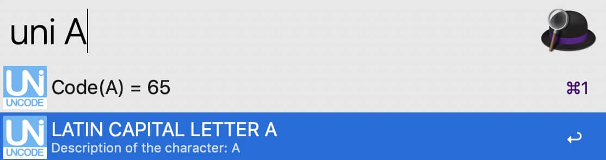

## Alfred workflow: Unicode tools

##### Description:

A set of *convenient​* tools for converting a character to unicode and converting a unicode to character.

##### Download:

Go [here](https://github.com/Emrys365/alfred_workflows/blob/master/UnicodeTools/UnicodeTools.alfredworkflow) and download it directly.

#### 1) Character to Unicode

##### Examples:

##### 

+ `uni 9`  ==>  `Code(9) = 57`
+ `uni √`  ==>  `Code(√) = \u221a`
+ `uni 好` ==> `Code(好) = \u597d`

#### 2) Unicode to Character

##### Examples:

- `chr 65`  ==>  `chr(65) = A`
- `chr \xa5` ==> `chr(\xa5) = chr(165) = ¥`
- `chr \u4F60\u597d\u554a\uff0c\u670b\u53cb\uff01` ==> `chr(\u4F60...\uff01) = 你好啊，朋友！`

#### 3) Base64 Encoding and Decoding

##### Examples:

+ `base64 Hello`  ==> `SGVsbG8=` (Base64 Encoding)
+ `base64 你好` ==> `5L2g5aW9` (Base64 Encoding)
+ `base64 5pyL5Y+L` ==> `NXB5TDVZK0w=` (Base64 Encoding)    `朋友` (Base64 Decoding)
