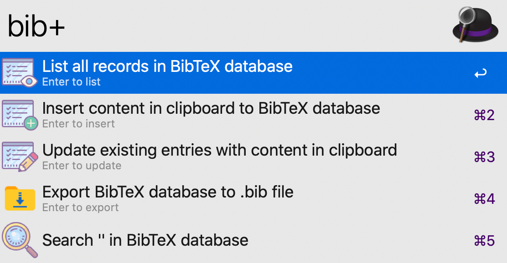
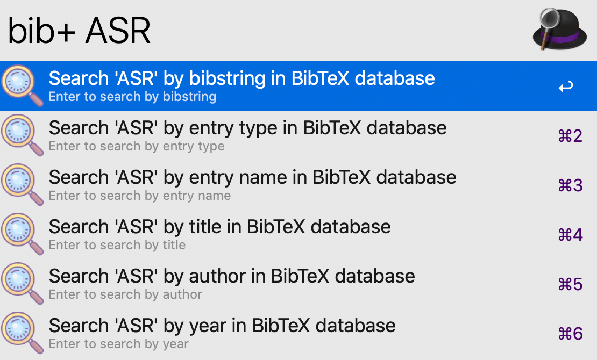
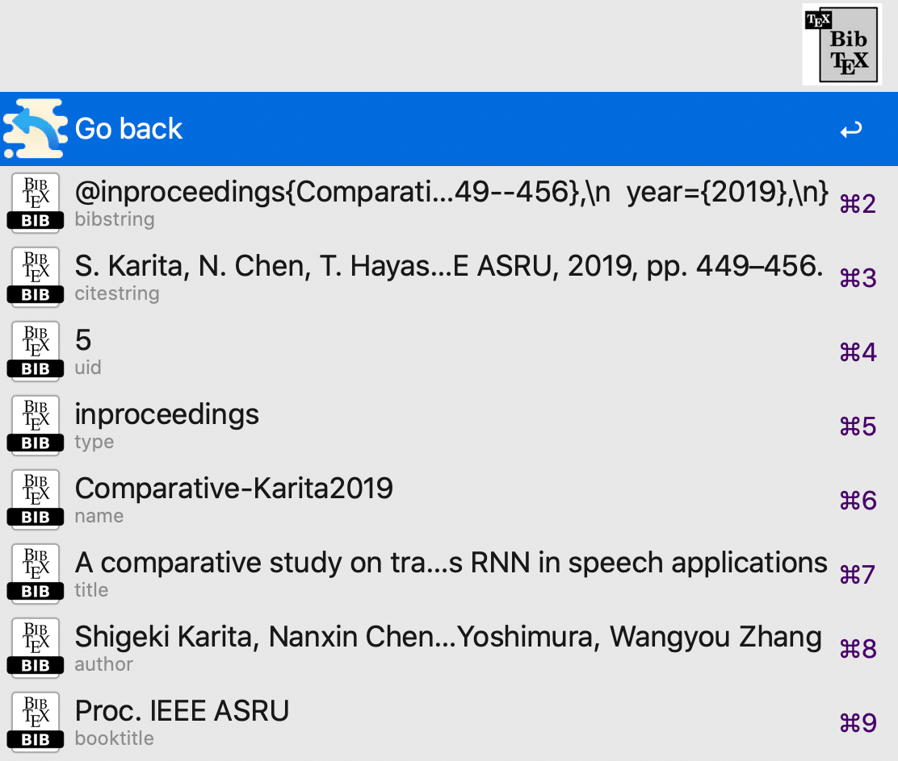

## Alfred workflow: BibTeX tool

##### Description:

This workflow could help you:
 - store new BibTeX entries from the clipboard for later retrieval
 - delete existing BibTeX entries
 - search for any stored BibTeX entry by entering some keywords
 - update existing BibTeX entries with the current clipboard
 - copy any stored BibTeX entry with various formats, including the raw BibTeX string, each separate field, and the rendered reference string
 - count and list all records in the current BibTeX database
 - export the current BibTeX database to a .bib file

It can parse most common BibTeX formats (supported by the BibTeX parser from [here](https://github.com/Emrys365/PlayWithLinux#3-bibtex-parser)) and store each entry in an SQLite database.
The stored BibTeX entries are automatically parsed and normalized with a predefined rule, e.g. the entry names will follow the same naming convention.

##### Download:

Go [here](https://github.com/Emrys365/alfred_workflows/blob/master/bibtexTool/BibTeX_tool.alfredworkflow) and download it directly.

> NOTE: As of MacOS Monterey 12.3, the builtin Python2 has been removed. You may need to manually install it and change the language interpreter in the Script Filter to an installed Python path.

##### Examples:

+ `bib+` + nothing: It will list all supported options.

  

  > Note: For the 2nd and 3rd options, if no valid BibTeX entry is found from the clipboard, an error message will be displayed.

+ `bib+` + `any keyword(s)` : It will list all matched BibTeX entries that contain the specified keyword(s) in the selected searching range.

  > Note: The searching algorithm is case-insensitive.

  

  Press "Enter" after selecting a way to search, and you will be prompted with a list of matched BibTeX entries:

  

  > Note: You can press "Enter" while holding the "Command" key to delete the selected BibTeX entry from the current database.

  Press "Enter" after selecting an item in the list, and the detailed information of the selected BibTeX entry will be listed:

  
