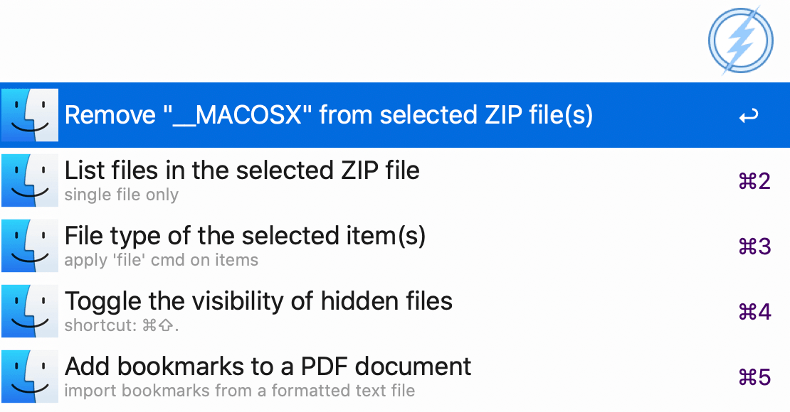
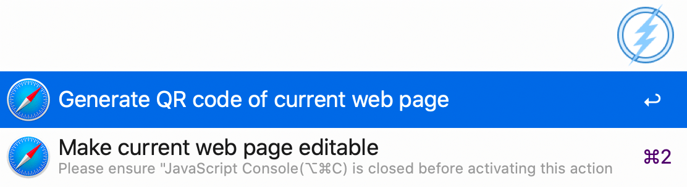
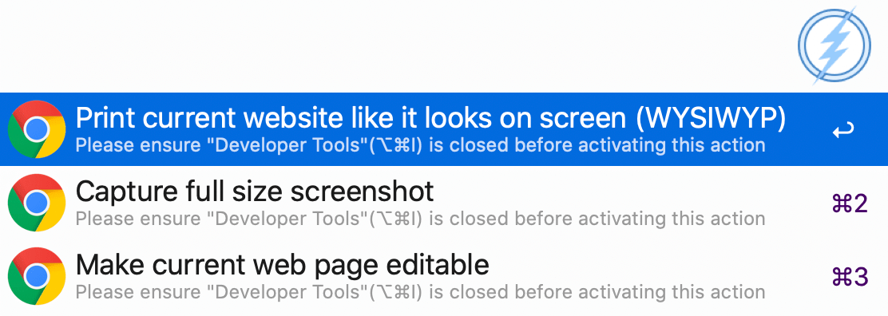
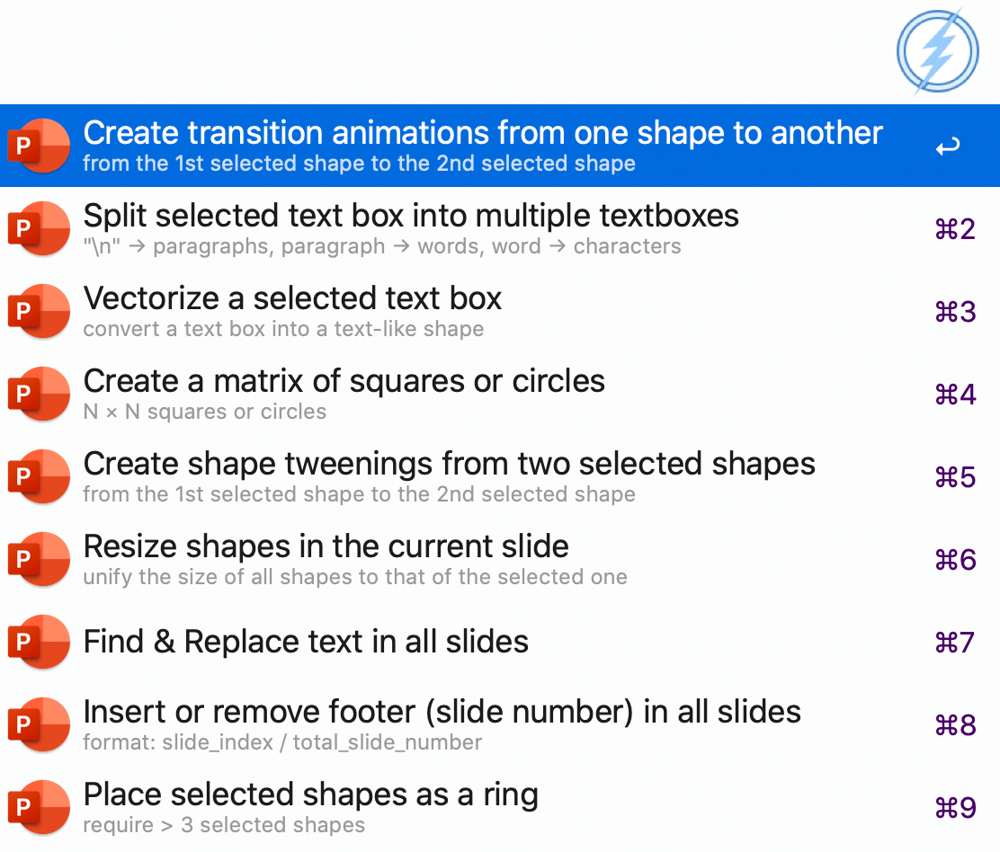
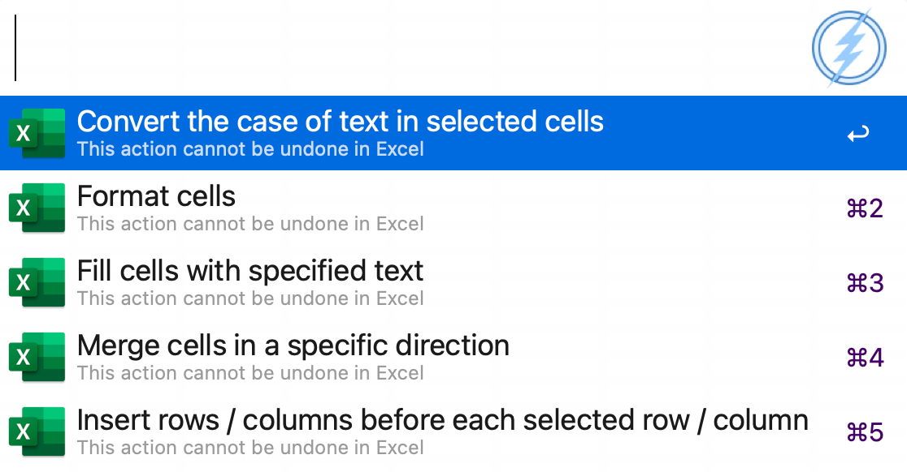

## Alfred workflow: quicker

##### Description:

This workflow is inspired by the [Quicker](https://getquicker.net) software in Windows. Most shortcuts in this workflow are implemented with the built-in AppleScript.

It provides convenient shortcuts for complex actions in some commonly used Mac apps. For example, it enables you to resize all pictures in your MS Word document without moving your mouse.

A lot of more interesting and useful shortcuts for different Mac apps are already available, and more shorcuts are being developed right now! If you have some interesting thoughts and want to contribute, please open a issue here.

Currently supported Mac apps are:

 * Finder
 * Microsoft Excel
 * Microsoft PowerPoint
 * Microsoft Word
 * Safari
 * Google Chrome

Note that some shorcuts are *locale dependent*, which means they may only work when your system language is **English** (e.g. `en_us`, `en_gb`). This is because the AppleScript needs to locate a certain button or other UI elements by their name, which differs in differen system languages. If you would like to make it work again, you can modify the corresponding script, which should be located in the same directory of this workflow.

> `P.S.` I have already added some conditional statements in such scripts to handle the locale issue. So you can modify them easily by simply replacing the names of the elements appeared in the script with those in your system language.

##### Download:

Go [here](https://github.com/Emrys365/alfred_workflows/blob/master/quicker/quicker.alfredworkflow) and download it directly.

##### Usage:

   `1st`  Open a window of the supported App

   `2nd`  Press `Cmd+Opt+x` to trigger this workflow

   `3rd`  Wait for the list of the preset shortcuts for this App

   `4th`  Choose one of the shortcuts and `Enter`

  ( `5th`  Follow the instruction if a dialog pops up)

##### Examples:

> Fuzzy matching is supported!
>
> You can narrow the range of the list by entering some keywords.

+ Shortcuts for `Finder` :

+ Shortcuts for `Safari` :

+ Shortcuts for `Chrome` :

+ Shortcuts for `Microsoft Word` :

+ Shortcuts for `Microsoft PowerPoint` :

> Special shortcuts for  `Microsoft PowerPoint` :
>
> + `option` + `: change the cursor to back an arrow during presentation
> + `option` + `1`: change the cursor to a red pen during presentation
> + `option` + `2`: change the cursor to a blue pen during presentation
> + `option` + `3`: change the cursor to a green pen during presentation
> + `option` + `4`: change the cursor to a yellow pen during presentation

+ Shortcuts for `Microsoft Excel` :

